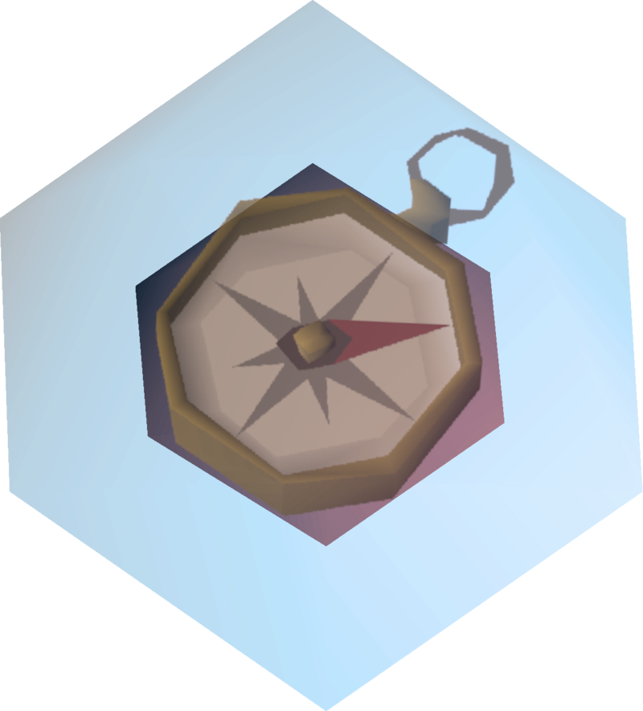
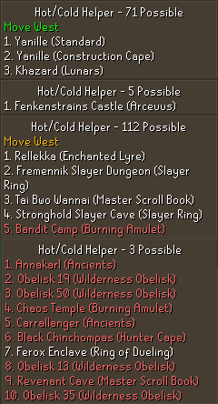
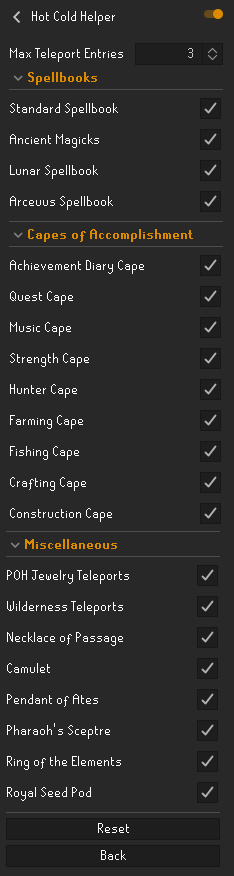

    
    <h3>Hot Cold Helper</h3>
    <h4>Helper tool to help with master clues Hot Cold steps</h4>

### Features

* Calculates the optimal location to teleport to in order to narrow down the correct hot cold destination
* Calculates if small moves (2 tiles north/east/south/west from current location) would provide information and if so, which direction to move (do note that most cases where movement is advised, most directions will work, this only shows the optimal move)
* Provides full configurability for all standard teleports types

### Examples

Below are a number of outputs from the plugin demonstrating the following features:

* Ordering based on optimal "information" gained from using the strange device at that location
* Shows the optimal small move location to move (coloured by how much <i>"expected value"</i> you might gain on your clue from following it)
* Wilderness steps marked in red
* Various number of possible teleport options supported (1-10) to allow for more freedom of choice in teleport locations at a trade-off of slightly lower information gained

### Configuration

* <b>Max Teleport Entries: </b> Value from 1-10, to indicate how many of the top results to show
* <b>Spellbooks: </b> Indicates which spellbook teleport locations can be selected as possible locations
* <b>Capes of Accomplishment:</b> Lists all Capes of Accomplishment with possible teleport locations on them to allow them in selection
* <b>Miscellaneous:</b> Various semi-optimal/alternative master clue solving teleport items to be added to the list of possible locations

 

<i> Disclaimer: Requires Clue Scrolls plugin to be enabled! (Default RuneLite Plugin) </i>

### Changelog

* v1.1: Added shorthand teleport locations (with hotkeys) as an optional toggle, and highlighting of optimal item in inventory